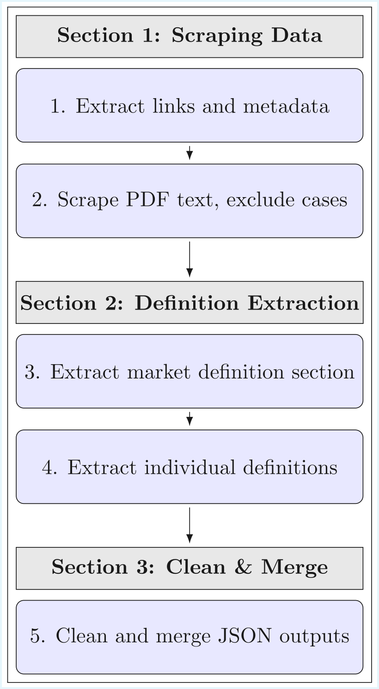

# Summary

Lextract is a Python pipeline that automatically locates, downloads, and extracts relevant market definitions from the European Commission’s merger and antitrust decision PDFs. Relevant market definitions establish the specific scope of competition legislation and identify the specific set of product in an area, making them indispensable for economists, lawyers, and regulators when determining the effects of mergers and evaluating anticompetitive behavior. This pipeline has been designed for researchers and competition law experts who require a quick and scalable way to extract relevant market definitions from many cases at once. Considering that market definitions are highly sensitive and, to some extent, arbitrary, Lextract has been designed and implemented to extract definitions are accurately as possible, as a slight change in the language of a definition can drastically change its meaning. The process is split into five main steps: (1) fetch links, (2) exclude irrelevant decisions PDFs and scrape the text of the rest, (3) extract the market definitions section, (4) extract individual market definitions, and (5) clean and combine JSON files. This modular design allows for the scalable, reproducible extraction of market definitions with vast applications.

# Statement of need

Competition authorities routinely delineate the relevant market as a first step in merger and antitrust assessments. Scholars analyze this language to track precedent, analyze trends in the scope of definitions, and identify the evolution of market definitions [@robertson2019]. Despite its significance, only one commercial product addressing this need exists: LexisNexis’s [Caselex Market Definitions Module](https://www.caselex.eu/services/service) which suffers from being proprietary, immutable, and inaccessible to many academics.

The Commission has published over 6,000 merger and antitrust decisions [@bldr2024] and continues to add 280 annually [@apdtsf2021], each formatted idiosyncratically and lengthy. Headings vary in language and definition placement within decisions is inconsistent. As a result, deterministic approaches such as regex are brittle and ineffective, while manual extraction is slow and irreproducible at scale. This pipeline rectifies this issue by providing a simple, open source way to extract market definitions that does not require manual guidance nor relies upon inaccurate patter matching techniques.

# General workflow

The general workflow for extracting market definitions is split into three sections and five steps. The first section involves the scraping of data, making use of regex: 1. A script processes an Excel file downloaded form the Commission's case search portal and extracts the links of decision documents and corresponding metadata (i.e. case number, year, policy area), saved in a plain text file. 2. Another script processes this file, and, using the decision document links, scrapes the decision text and convert them into a text corpus with the metadata, repeating this step for each link, while also sorting the corpus based on its length, with a break point a 80,000 characters. It is during this process that decision documents without market definitions, identified by certain phrases or a page length less than three, are excluded. 

The second section is responsible for the semantic extraction of market definitions: 3. Google Gemini is used to identify and extract only the section of the text corpus that contains the market definition section. 4. Afterwards, the process becomes more granular, with Gemini again being used, only this time to identify and isolate each individual market definition within those sections. Each definition is then tagged with a topic and saved in a structured JSON file, where each object contains all elements of the aforementioned metadata, a topic, and the market definition. 

The third and final section improves the presentation of the data: 5. Each separate JSON file is cleaned to remove extraneous characters and then aggregated into a single file, which can then be used for research and analysis. By structuring the workflow this way, each processed case is consistently analyzed, reducing variability and improving accuracy. Lextract’s code also maintains a high level of accuracy, substantiated by a comprehensive test suite with 94% code coverage.

{ width=45% }

# Research applications

Lextract powers the database of [JurisMercatus](https://jurismercatus.vercel.app/), an open source search intercace that allows users to search for market definitions, leveraging the power of semantic search. The metadata provided by Lextract enables filtering by year, policy area, and case number. Further, this resource has the capability to support greater academic research and improve the accessability of market definitions.

# Limitations

It should be noted that this system, as with all systems, is not perfect and contains inaccuracies. First, with regards to step three, as a result of the previously mentioned fact that the heading used to identify the market definition section is inconsistently phrased, what constitutes the market definition is only heuristically defined, potentially leading to inaccuracies, especially when the language of decision texts deviate significantly from expected pattern. Secondly, the quality and reliability of the extraction is limited to that of the input. In other words, should the input consist of missing pages or unconventional language, the model may be confused, leading to partial or inaccurate results. Additionally, though it is understood that decisions are adjudicated in many different languages, with the European Commission using multiple itself, the pipeline assumes that all decisions are provided in English and excludes all others, thereby limiting its application to other languages, without at least a moderate amount of modification.

Lastly, while this pipeline makes use of Google Gemini, it is model-agnostic and, if properly refactored, could utilize any LLM, including commercially hosted models like OpenAI’s or locally deployed ones such as LLaMA, Mistral, or DeepSeek. However, accuracy and consistency will vary significantly depending on model size and capabilities. Generally, smaller models, especially local ones without a sufficient context length or reasoning ability, will tend to hallucinate outputs, misidentify sections, or produce partial definitions.

| Model Type                   | Accuracy | Context Length | Speed    | Cost     | Scalability |
| ---------------------------- | -------- | -------------- | -------- | -------- | ----------- |
| Hosted Large (GPT-o3)        | High     | Very High      | Moderate | High     | Moderate    |
| Hosted Small (Gemini Flash)  | Moderate | High           | Fast     | Moderate | High        |
| Local Large (DeepSeek 67B)   | Moderate | Medium         | Slow     | Low      | Low         |
| Local Small (LLaMA 3-8B)     | Low      | Low            | Moderate | Low      | Low         |

# Acknowledgements

I thank Professor Thibault Schrepel for his advisement and guidance throughout the project.

# References

