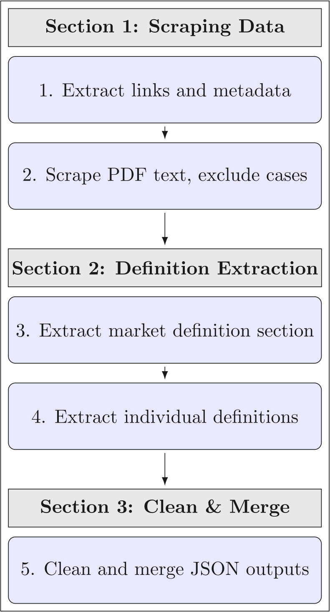

# Summary

Lextract is a Python pipeline that automatically extracts relevant market definitions from the European Commission’s merger and antitrust decision PDFs. Relevant market definitions establish the scope of competition legislation and identify the specific set of products in an area [@tp2017], which make them indispensable for economists, lawyers, and regulators when determining the effects of mergers and evaluating anticompetitive behavior [@ptm2020]. This pipeline has been designed for researchers and competition law experts who require a quick and accurate way to extract relevant market definitions from many cases at once. This level of accuracy is accomplished by using strict natural language processing and rule-based pattern recognition [@bjbmmcmnthsktczmm2025; @csfafemspsrdsc2024] to identify market definitions while excluding all irrelevant information. By automating this process, Lextract enables merger and antitrust research at scale and contributes to more efficient competition policy analysis.

# Statement of need

Competition authorities routinely delineate relevant markets as a first step in merger and antitrust assessments. The definition of the relevant market establishes the market position of firms operating within it, therein making its establishment necessary for regulators and courts to control mergers and evaluate potential abuses of dominant positions; this makes defining the relevant market a predominant step in competition law analysis. For instance, in the 2025 case United States v. Google LLC, the outcome of the decision was impacted by how the relevant market was defined and whether or not Google and its services were found to hold a dominant position within that market [@usvg2025].

Despite its significance, only one commercial product addressing the need to quickly access relevant market definitions exists: LexisNexis’s [Caselex Market Definitions Module](https://www.caselex.eu/services/service) which suffers from being proprietary, immutable, and inaccessible to many academics.

Furthermore, the Commission has published over 6,000 merger and antitrust decisions [@bldr2024] and continues to add 280 more annually [@apdtsf2021], each structured and formatted idiosyncratically, with inconsistent placement of definitions and headings that vary in language. As a result, deterministic approaches such as regex are brittle and ineffective [@wpbcjajstk2020] for extracting market definitions, while manual extraction is slow and irreproducible at scale. This pipeline rectifies this issue by providing a simple, open source way to extract market definitions that does not require manual guidance nor rely upon inaccurate pattern-matching techniques.

# General workflow

The general workflow for extracting market definitions is split into three sections and five steps. The first section involves the scraping of data, which makes use of regex: 1. A script processes an Excel file downloaded from the [Commission's case search portal](https://competition-cases.ec.europa.eu/) and extracts the links of decision documents and corresponding metadata (i.e., case number, year, policy area), saved in a plain text file. 2. Another script processes this file, and, using the decision document links, scrapes the decision text and converts it into a text corpus with the metadata, repeating this step for each link, while also sorting the corpus based on its length, with a breakpoint at 80,000 characters. It is during this process that decision documents without market definitions, identified by certain phrases or a page length less than three, are excluded. 

The second section is responsible for the semantic extraction of market definitions: 3. Google Gemini is used to identify and extract only the section of the text corpus that contains the market definition section. 4. Afterwards, the process becomes more granular, with Gemini again being used, only this time to identify and isolate each individual market definition within those sections. Each definition is then tagged with a topic and saved in a structured JSON file, where each object contains all elements of the aforementioned metadata, a topic, and the market definition. 

The third and final section improves the presentation of the data: 5. Each separate JSON file is cleaned to remove extraneous characters and then aggregated into a single file, which can then be used for research and analysis. By structuring the workflow this way, each processed case is consistently analyzed, reducing variability and improving accuracy [@pmohlcacmm2025]. It also allows Lextract’s code to maintain a high level of accuracy, substantiated by its comprehensive test suite with 94% code coverage.

{ width=43% }

# Research applications

Lextract powers the database of [JurisMercatus](https://jurismercatus.shriyanyamali.com/), an open source search interface that allows users to semantically search for market definitions. The metadata provided by Lextract enables filtering by year, policy area, and case number. Further, this resource has the capability to support greater academic research and improve the accessibility of market definitions.

# Limitations

It should be noted that this system, as with all systems, is not perfect and contains inaccuracies. First, with regards to step three, as a result of the previously mentioned fact that the heading used to identify the market definition section is inconsistently phrased, what constitutes a market definition heuristically and arbitrarily defined, potentially leading to inaccuracies, especially when the language of decision texts deviates significantly from the expected pattern. Secondly, the quality and reliability of the extraction are limited to that of the input. In other words, should the input consist of missing pages or unconventional language, the model may be confused and output partial, hallucinated, or inaccurate results [@vsfjdgxszgwb2024]. Additionally, though it is understood that decisions are adjudicated in many different languages, with the European Commission using multiple itself, to maintain accuracy, the pipeline excludes all decisions that are not provided in English, thereby limiting its application to other languages without at least a moderate amount of modification.

Lastly, while this pipeline makes use of Google Gemini, it is model-agnostic and, if properly refactored, could utilize any LLM. This includes commercially hosted models like OpenAI’s or locally deployed ones such as LLaMA, Mistral, or DeepSeek. However, accuracy and consistency will vary significantly depending on model size and capabilities. Generally, smaller models, especially local ones without a sufficient context length or reasoning ability, will tend to hallucinate outputs, misidentify sections, or produce partial definitions [@ktanovssze2025].

| Model Type                  | Accuracy | Context Length | Speed    | Cost    |
|-----------------------------|----------|----------------|----------|---------|
| Hosted L (eg. GPT-4o)       | High     | Very High      | Moderate | High    |
| Hosted S (eg. Gemini Flash) | Moderate | High           | Fast     | Moderate|
| Local L (eg. DeepSeek 67B)  | Moderate | Medium         | Slow     | Low     |
| Local S (eg. LLaMA 3-8B)    | Low      | Low            | Moderate | Low     |

Table I compares the relative capabilities (accuracy, context length, speed, cost) of different LLMs when applied to the task of extract relevant market definitions. “L” = Large models (>30B parameters); “S” = Small models (<30B parameters).

# Acknowledgements

I am grateful to Professor Thibault Schrepel of Stanford Law School for his invaluable advisement and guidance throughout the course of this project. This research received no funding from any government agency, university, company, or non-profit organization.

# Conflict of Interest

The author declares no conflict of interest.

# References

